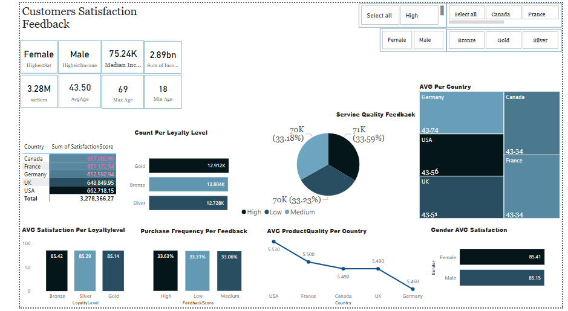

# Customer Feedback & Satisfaction Dashboard (Excel & Power BI)

This project presents a data-driven customer satisfaction dashboard built using Microsoft Excel and Power BI. It visualizes customer feedback, purchase behavior, and satisfaction metrics using a structured star schema with fact and dimension tables.

## 🔧 Tools & Technologies
- Microsoft Excel (data cleaning and modeling)
- Power BI (interactive visual dashboards)
- Power Query
- DAX

## 🗃️ Data Model

The dataset is modeled using a central fact table and supporting dimension tables.

### 📌 Fact Table Columns:
- `CustomerID`
- `Age`
- `Gender ID`
- `Country ID`
- `FBScore ID`
- `LoyaltyLevel ID`
- `Income`
- `ProductQuality`
- `ServiceQuality`
- `PurchaseFrequency`
- `SatisfactionScore`

### 📌 Dimension Tables:
- `LoyaltyLevel`
- `Country`
- `Gender`
- `FeedbackScore`

## ✅ Key Features
- Clean and interactive Power BI visuals
- Star schema structure with relationships
- Comprehensive customer feedback analysis
- Business-focused metrics: Product Quality, Service Quality, Purchase Frequency, Satisfaction Score

## 📌 Key Insights
1. Analyzed service quality trends across customer segments
2. Explored loyalty level distribution across different countries
3. Evaluated the relationship between customer income, purchase frequency, and satisfaction
4. Identified top-performing regions and demographics in terms of product and service quality

## 🖼️ Dashboard Preview

## 📁 Folder Structure

- `dashboard/` – Contains Power BI dashboards
- `data/` – Raw and cleaned datasets used for analysis
- `images/` – Dashboard screenshot for preview
- `README.md` – Project overview and documentation
